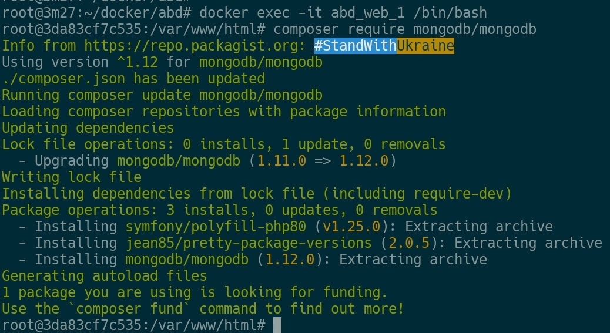
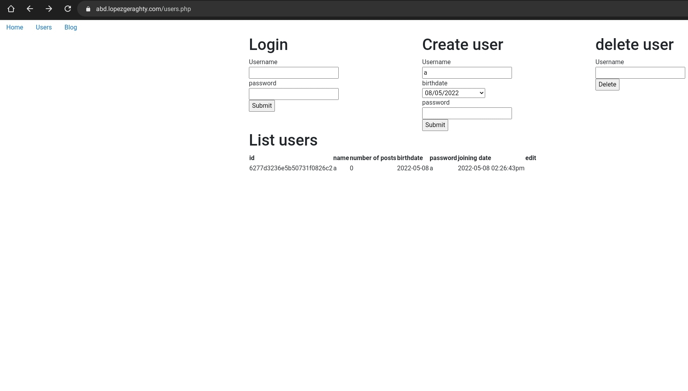
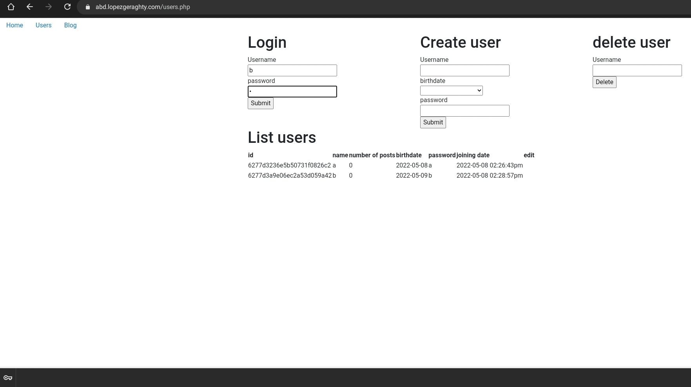

\newpage

# Infraestructura de la aplicacion
He decidido desarrollar esta aplicacion con unas herramientas modernas que la hacen facil de reproducir en otros entornos independientes del sistema operativo.

## Github
He decidido usar el control de versiones de git con Github, que nos permite implementar workflows avanzados para hacer desarrollo e integracion continua.
En el siguiente link [https://github.com/dlgeraghty/abd](https://github.com/dlgeraghty/abd) se puede ver tanto el codigo como las diferentes versiones.
Ademas, Github cuenta con un registro de imagenes de docker que he utilizado en la aplicacion, se puede encontrar en el siguiente link [https://github.com/users/dlgeraghty/packages/container/package/abd_web](https://github.com/users/dlgeraghty/packages/container/package/abd_web)

## Hosting
Esta aplicacion esta hosteada en mi servidor y puede ser encontrada en la url: [https://abd.lopezgeraghty.com/](https://abd.lopezgeraghty.com/), esto es para hacerla lo mas accesible en caso de que una instalacion manual fallase. La integracion con entre el sistema de control de versiones y Github es total, de forma que cada vez que se suben los cambios a la rama principal de Github, se suben tambien al servidor.

## Docker
He dockerizado la aplicacion, que usa una imagen que yo he compilado modificando la de base de php. Esta no incluye por defecto soporte para mongodb. Aunque compilararla de nuevo no es dificil, requiere cierto tiempo que prefiero ahorrar. He hosteado esta imagen en mi github asi como su archivo para compilarla si fuera deseable (Dockerfile).
Además, es necesaria otra imagen, la que soportará la base de datos, oficial de MongoDB.
Para que la aplicación pueda ser más fácilmente reproducible, he configurado un soporte físico para los archivos de la base de datos (en docker-compose.yml linea 10) de esta manera cuando se construya la aplicación, la base de datos leerá y escribirá en esta carpeta.
Finalmente, todo se une gracias al archivo docker-compose.yml, que es el único al que debemos hacer referencia cuando vayamos a arrancar la aplicación.

## Como arrancar la aplicacion
Hay dos formas de utilizar la aplicacion:
1. Como he mencionado antes, yo ya tengo la aplicacion instalada y desplegada en un servidor. Puede ser accedida y usada en la url [https://abd.lopezgeraghty.com/](https://abd.lopezgeraghty.com/) y el codigo en el repositorio de Github. Recomiendo esta opcion debido a algunas dificultades tecnicas que existen cuando se levanta la aplicacion de forma manual
2. Si se quiere desplegar manualmente, se han de seguir los pasos que expongo:
2.1 Se debe garantizar que hay una instalacion de docker funcionando correctamente.
2.2 Se descarga el docker-compose.yml del repositorio, nos dirigimos directorio donde hayamos descargado el archivo y ejecutamos el comando docker-compose up -d.

2.3 Debido a una limitacion tecnica (no se puede subir el archivo composer.json, composer.lock a Github por su peso), se debe ejecutar un comando dentro de uno de los contenedores docker. Debemos ejecutar *docker exec -it abd_web_1 /bin/bash* para entrar a la aplicacion, y una vez dentro debemos ejecutar *composer require mongodb/mongodb* como se ve en la imagen:

2.4 Asimismo, podemos acceder al contenedor de mongodb para inspeccionar su base de datos si ejecutamos el comando docker-exec -it mongodb /bin/bash:

2.5 Ahora, ya tendremos la aplicacion accesible desde cualquier navegador en el puerto 8090

\newpage
# Funciones de la aplicacion
## Introduccion
La aplicacion ofrece la gestion de usuarios. Estos pueden ser creados, leidos, actualizados y eliminados.  
Estos usuarios pueden, a su vez, crear posts en un blog, asi como ver los de los demas, actualizar los suyos.  
La aplicacion presenta un estilo moderno y simple, elaborado con bootstrap

## Home
En lo relativo a las vistas que aparecen en el blog, encontramos tres diferentes: por un lado, la vista Home, en la que encontramos escrita la memoria. En esta vista no se puede interactuar, solo nos permite visualizar la memoria que constituye la aplicacion.  

## Users
En segundo lugar, encontramos la vista Users, a traves de la cual puedes loguearte como usuario. De esta manera, dicha vista permite crear y borrar un usuario y, a su vez, ofrece una visualizacion de los usuarios listados. 

## Blog
Por ultimo, encontramos la vista denominada Blog, a traves de la cual se puede crear y escribir un blog siempre que estes logueado y, a su vez, puedes editar tus propios posts o publicaciones. Sin embargo, cuando no estas logueado no puedes crear ni escribir ningun post o publicacion y, de la misma manera, tampoco aparece la opcion de editar que hemos mencionado anteriormentente, por lo que no puedes editar el blog. 

Por otra parte, es necesario hacer referencia tambien al apartado Welcome, a. Cuando este apartado aparece, significa que estas logeado, de manera que, si dejas de estar logueado en la aplicacion, como consecuencia, este apartado desaparecera del menu.  
Asimismo, cabe mencionar tambien la importancia del apartado Logout. Si pinchas en el mismo, dejaras de estar logueado automaticamente y el apartado o mensaje Welcome, desaparecera del menu como hemos explicado prevoiamente. Al no estar logueado, no se pueden hacer las mismas cosas que estando logueado, de manera que se limita, de esta forma, el numero de cosas u opciones que puedes hacer y desarollar a traves de esta aplicacion: para empezar, en lo que respecta a la vista Users y en la seccion de List Users, la columna denominada edit (para editar) sale vacia, al contrario que si estuviesemos logueados, que podriamos editar nuestro usuario y la opcion edit si que apareceria. Para continuar, tambien observamos estos cambios entre las opciones que se pueden desarrollar o no, dependiendo de si estamos logueados en la aplicacion a no en lo relativo a la vista denominada blog y en el apartado de Welcome, a (estos cambios y diferencias aparecen especificados anteriormente en la explicacion de cada una de dichas secciones). En conclusion, podemos identificar diversas diferencias y cambios en el menu (y, por suspuesto, en apartados que constituyen el mismo), asi como en las opciones a desarrollar dependiendo de si estamos logueados o no en la app.

# Tablas de la base de datos  
En la base de datos encontramos 2 tablas: users y UserPosts.

## Users  
Contiene documentos que representan la informacion de un usuario: id, nombre (se usa como clave para las operaciones), numero de posts, fecha de nacimiento, password, fecha de union

## UserPosts  
Contiene documentos que representan la informacion de un post: id, creador, titulo (se usa como clave para las operaciones), categoria, contenido, fecha de creacion